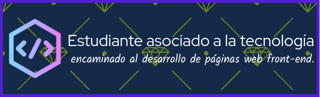

# Bienvenid@ a mi github 👋   

# Skills

  
 

## 🌐 Technologies Used

- **Frontend**:  
  

My top languages

| Rank | Languages |
|-----:|-----------|
|     1| JavaScript|
|     2| Python    |
|     3| SQL       |

<!--
**albertsadday/albertsadday** is a ✨ _special_ ✨ repository because its `README.md` (this file) appears on your GitHub profile.

Here are some ideas to get you started:

- 🔭 I’m currently working on ...
- 🌱 I’m currently learning ...
- 👯 I’m looking to collaborate on ...
- 🤔 I’m looking for help with ...
- 💬 Ask me about ...
- 📫 How to reach me: ...
- 😄 Pronouns: ...
- ⚡ Fun fact: ...
-->

[def]: github-header-image.png
